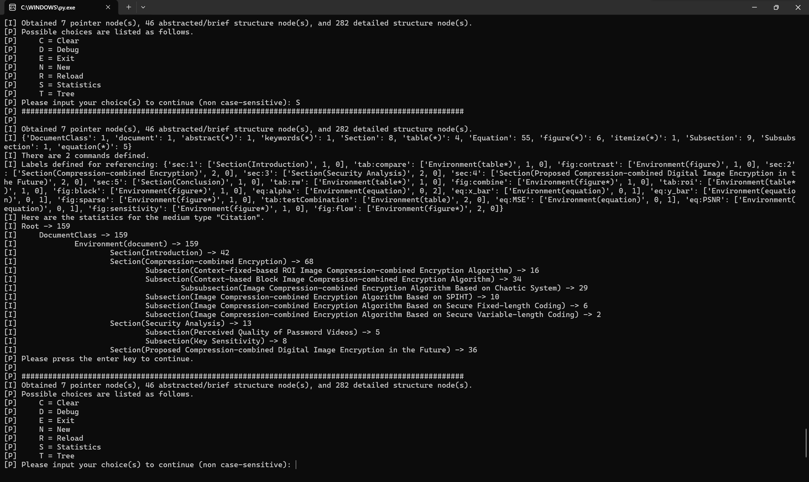

# LaTeXChecker

This is an implementation for checking LaTeX source files using [multiple typesetting styles for one manuscript](https://github.com/BatchClayderman/onePaperMultipleTypesettingStyles). 

| Version range | Major feature | Recommended version |
| --- | --- | --- |
| [``v0.0``, ``v1.0``] | The input is a folder while the script runs in read-only mode. | ``v1.0`` |
| (``v1.0``, ``v3.0``) | The input is the main TEX file while the script runs in read-only mode. | ``v2.8`` |
| ``v3.0`` | The input is the main TEX file while the script has modification behaviors.  | ``v3.0`` |

## checkCite.py (LaTeXChecker v1.0)

This version of the script is used to check the LaTeX files without understanding them. 

The version will parse them using string search and regular expressions after reading all the TEX files in the target folder. 

Since this version will no longer be under maintenance, it is recommended to use the latest version where the input is the main TEX file. 

You can still use this version of the script that may contain potential errors to handle the situation where the input is a folder if you wish to. 

## checkLaTeX.py (LaTeXChecker (``v1.0``, ``v2.0``))

These versions of the script are used to check the LaTeX files with the main TEX file as the input, supporting complex structures. 

Starting from these versions, the input should be the main TEX file instead of a folder. 

Here are some incomplete implementations based on some baseline ideas. 

### v1.3

In this version, some functions are accomplished. 

However, it is not an optimal way to handle LaTeX checking tasks. 

This version of the script cannot run. It acts as a thought provider here. 

### v1.5

The ``Pointer`` and the ``Structure`` are separated. 

Compared with ``v1.3``, the codes are more readable and the thought is more feasible. 

This version of the script cannot run. It acts as a thought provider here. 

### v1.7

This is the last version before v2.0, which leads to the mature structure-building idea. 

The active mode is used in the parsing with the character-by-character reading. 

## LaTeXChecker (LaTeXChecker [``v2.0``, ``v3.0``))

Start to be a mature checker with file tracking and structure recognition. 

### v2.0

This is the initial version of ``LaTeXChecker.py`` that supports complex structures with understanding the LaTeX files. 

### v2.1

Interaction is accomplished in this version. 

Initial support to command definitions is added. 

More complex situations are considered during the resolution. 

### v2.3 (20241111)

Add support for label and citation checking, covering parts of the functions in LaTeXChecker v1.0. 

### v2.4 (20241112)

Cover all the checking functions in LaTeXChecker v1.0. 

Add support to check whether all the structures are closed. 

Fix bugs in the stack of the pointer. 

Support more commands. 

### v2.5 (20241116)

Adjust the style of the connection lines. 

Fix some bugs. 

Change the behaviors for ``.gv`` files. Revise the extension ``.gz`` to ``.gv``. 

Change the option recognition mode to the non-case-sensitive one. 

### v2.6 (20241124)

Fix the bug of using ``\end{document}`` to end sections and subsections. 

Print the information on the leaving structure node mentioned above for debugging information via a queue. 

Add support for newly defined environments. 

### v2.7 (20241130)

Formalize the main body ``\xxx{yyy}`` recognition. 

### v2.8 (20241227)

Merry Christmas! 

The calculation of the number of references per paper, section, subsection, and subsubsection is added. 

Thanks to [@yiyistudy](https://github.com/yiyistudy) for providing the idea of adding an extendable dictionary to accomplish the calculation. 

This update is debugged once and successfully passed after it was written, marking the implementation of all features in ``v1.0``. 

The logic of selecting a main TEX file in a folder containing multiple TEX files is adjusted. 

## LaTeXChecker (LaTeXChecker [``v3.0``, ``v4.0``))

Starting from ``v3.0``, the script will have some functions that may modify the LaTeX source files. 

If you are afraid of the modification, please use the versions earlier than ``v3.0``. 

### v3.0 (20241228)

Happy New Year! 

Added the compilation operations. 

Detecting and modifying ``cas-common.sty`` are supported, which can uniform the font of the text in figure captions and tables to "Times New Roman". 

The ``bytes`` type is used to replace all the b"\\sffamily" with b"\\rmfamily" to ignore the encoding and decoding issue. 

### v3.1 (20250116)

The logic of some functions was updated. 

### v3.2 (20250317)

Support multiple typesetting styles for one paper more friendly. 

## Screenshot(s)

